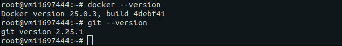
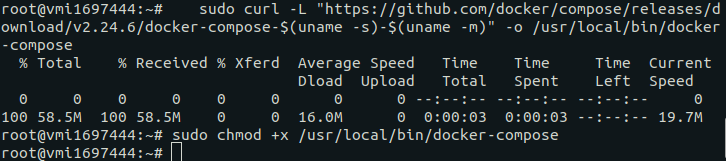
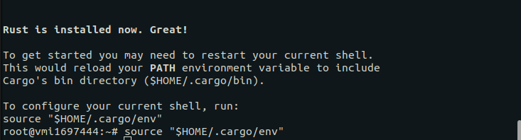
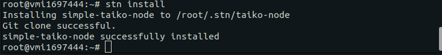
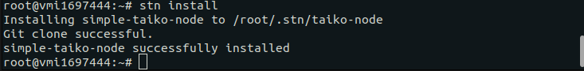
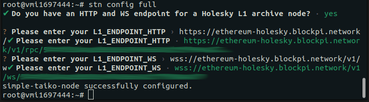

# Przewodnik uruchomienia Taiko L2 Node

Przewodnik ten krok po kroku przeprowadzi Cię przez proces uruchomienia noda Taiko w testowej sieci Holesky.

## Oficjalna Dokumentacja

Możesz zapoznać się z oficjalną dokumentacją dostępną na [docs.taiko.xyz/guides/run-a-taiko-node/](https://docs.taiko.xyz/guides/run-a-taiko-node/).


## To jakieś czary?

Te instrukcje wymagają pewien poziom umiejętności obsługi komputera za pomocą terminala/wiersza poleceń. Jeśli wydaje się to dla Ciebie zbyt skomplikowane, mogę zająć się tym procesem za Ciebie. Oczywiście w zamian za wirtualne szekle - 95 USDT/C, a w cenie:

- postawienie serwera - potrzeba udostępnienia wirtualnej karty płatniczej, z małym limitem transakcyjnym, na pokrycie kosztów serwera. (Mogę też przeprowadzić przez proces zakładania serwera na Contabo, kosztuje to dodatkowe 15 usdc)  
- konfiguracja serwera - potrzebne dane do logowania ssh (w przypadku pominięcia pierwszego punktu)
- instalacja i konfiguracja noda - potrzebne będą adresy API *http* i *wss* (łatwe do zdobycia)

Jeśli jesteś zainteresowany/a postawieniem tego noda za Ciebie to zapraszam do kontaktu: 
- telegram: **@misiurr**

  # INSTRUKCJE

### Konfiguracja Serwera

1. Potrzebujemy serwera do uruchomienia noda. VPS od [Contabo](https://contabo.com/en/vps/) będzie odpowiedni.
   - Zalecany wybór to **CLOUD VPS 1** z **400 GB/SDD** dla Storage Type oraz **Docker Ubuntu 20.04** jako Image.

### Przygotowanie Serwera

1. Oczekuj na e-mail z danymi do logowania do VPS.

2. Po zalogowaniu wykonaj aktualizację VPS:

```bash
sudo apt-get update && sudo apt-get upgrade -y
```

3. Upewnij się że Docker i git jest zainstalowany

```bash
docker --version
```

```bash
git --version
```


5. Zainstaluj Docker-Compose:

```bash
sudo curl -L "https://github.com/docker/compose/releases/download/v2.24.6/docker-compose-$(uname -s)-$(uname -m)" -o /usr/local/bin/docker-compose
```
   
```bash
sudo chmod +x /usr/local/bin/docker-compose
```


6. Zainstaluj stn

   - Instalacja RUST
```bash
curl --proto '=https' --tlsv1.2 -sSf https://sh.rustup.rs | sh
```
		- wybierz opcje 1

```bash
source "$HOME/.cargo/env"
```



  - Instalacja kompilatora C

```bash
sudo apt install build-essential
```

  - Instalacja stn  

```bash
cargo install stn
```



### Uruchomienie Taiko node przy pomocy stn

1. Instalacja Taiko node

```bash
stn install
```




2. Konfiguracja noda
   - tutaj potrzebne będą adresy API *http* i *wss*, które można zdobyć:
     - z własnego Holesky L2 archive node (trzebo go najpierw postawić)
     - od RPC provider takiego jak np. [BlockPi.io](https://blockpi.io/) (po rejestracji zapewniają darmowy przydział)
    
```bash
stn config full
```



3. Uruchomienie node

```
stn up
```

4. Sprawdzenie statusu
```
stn status
```
UWAGA na początku może fauszywie zwracać syncing 100%, sam proces synchronizacji może być dość długi.

	Dashboard dla twojego noda powinien być dostępny pod adresem
	(zamień localhost na IP twojego VPS):
	http://localhost:3001/d/L2ExecutionEngine/l2-execution-engine-overview
